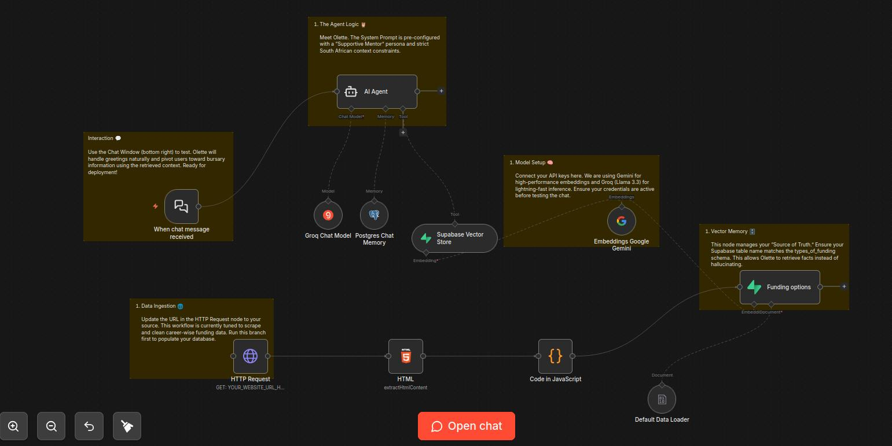

# Olette – Career Wise Funding Assistant 🦉

> AI‑powered funding assistant for South African students. Built with **RAG**, **Groq (Llama 3.3)**, **Gemini embeddings**, and **Supabase** – all orchestrated in **n8n**.

---

## 🎯 What It Does

- Acts as **Olette** – a warm, concise South African mentor  
- Answers only about **bursaries & loans** (pivots away from scholarships)  
- Uses a **vector database** (Supabase pgvector) for factual retrieval – no hallucinations  
- Remembers conversation history via **Postgres** memory  

---

## 🛠️ Tech Stack (Skills on Display)

| Layer            | Tools                                                                 |
|------------------|-----------------------------------------------------------------------|
| Workflow engine  | n8n (custom RAG pipeline, webhook trigger, chat interface)           |
| LLM              | Llama 3.3 70B (Groq – fast inference)                                |
| Embeddings       | Google Gemini (`embedding-001`)                                      |
| Vector store     | Supabase (pgvector – with custom match function)                     |
| Memory           | PostgreSQL                                                            |
| Data ingestion   | HTTP request + HTML extraction + JavaScript cleaning                |

---

## 📸 Workflow Screenshot

The workflow is split into:
- **Left:** Scraping + chunking + embedding + storing  
- **Right:** Chat trigger + agent tool (vector store) + memory

---

## 📽️ Live Demo

*Click to see a real conversation: from “Hi” to funding requirements, with perfect persona adherence.*

---

## ✨ Why This Matters for Clients

- **Modular & reusable** – swap the data source (any webpage, PDF, or database)  
- **Production ready** – uses webhooks, secure credentials, scalable vector search  
- **Persona‑driven** – system prompt enforces brevity, pivoting, South African tone  
- **No hallucinations** – RAG forces answers from your own content  

---

## 🚀 Quick Start (for your own testing)

1. Import the `.json` into n8n.  
2. Add your Groq, Gemini, Supabase, and Postgres credentials.  
3. Replace the HTTP Request URL with your funding page.  
4. Run the ingestion branch once → chat with Olette.

All placeholders are clearly marked in the workflow.

---

## 📬 Contact

Built by **[Your Name]** – [your portfolio link]  
Interested in a custom AI assistant for your organisation? Let’s talk.
